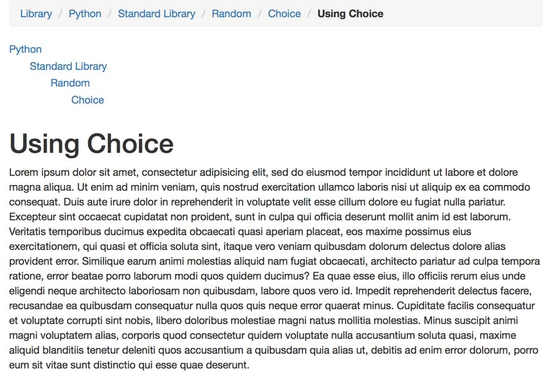

Library-MPTT
============

A proof-of-concept Django app that creates a library of folders and files, where the folders
can be arbitrarily nested, and files can live at any level in the folders.

It uses pretty slug-urls, like

   /library/folder-a/folder-b/
   /library/folder-a/folder-b/document-1/

and resolves these to the correct folder or document, even though the slugs must be unique only
with regard to their container.

It uses django-mptt for efficient tree handling.

It was tested with Django 1.8b1 but should work with any moderately recent Django release.

